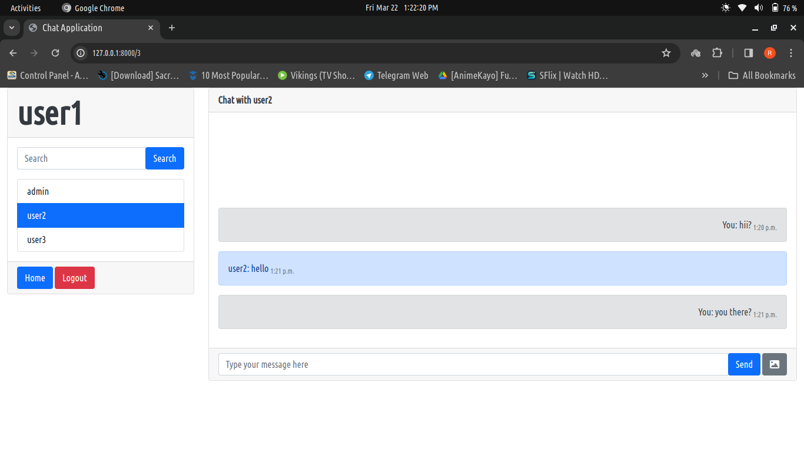

# Yyuichat

Yyuichat is a web application built using Django, Django Channels, Redis Channel Layer, HTML, CSS, Bootstrap, JavaScript, and HTMX. It enables users to engage in one-to-one chat sessions within the web application. Messages exchanged are stored in the database, allowing users to view their chat history. Additionally, Yyuichat supports image sharing functionality, although images are not stored in the database. Consequently, upon page reload, sent and received images will not persist.

## Features

- **One-to-One Chat:** Users can engage in private conversations with each other.
- **Message Storage:** Messages are stored in the database, facilitating chat history retrieval.
- **Image Sharing:** Users can send and receive images within the chat interface.
- **Real-Time Communication:** Utilizing Django Channels and Redis Channel Layer, Yyuichat enables real-time message exchange.
- **Responsive Design:** The application interface is designed to adapt to various screen sizes, ensuring usability across different devices.

## Technologies Used

- **Django:** A high-level Python web framework for rapid development and clean, pragmatic design.
- **Django Channels:** Extends Django to handle WebSockets, allowing real-time features in web applications.
- **Redis Channel Layer:** Provides the channel layer for Django Channels, enabling communication between multiple instances of Django Channels.
- **HTML, CSS, Bootstrap:** Frontend technologies for designing and styling the user interface.
- **JavaScript:** Used for client-side scripting, enabling interactive features.

## Installation

### 1. Clone the repository:

```bash
git clone https://github.com/Yyuichiii/YyuiChat.git
```

### 2. Install the dependencies:

```bash
pip install -r requirements.txt
```

### 3. Run migrations:

```bash
python manage.py migrate
```

### 4. Start the redis server (For Linux):

```bash
sudo systemctl start redis-server
```

### 5. Start the development server:

```bash
python manage.py runserver
```

### 6. Access the application in your web browser at `http://localhost:8000`.


## Screenshots




## Usage

1. Sign up for an account or log in if you already have one.
2. Navigate to the chat interface.
3. Start a new conversation by selecting a user from your contacts or search for a user by username.
4. Exchange messages and images with the selected user.
5. Chat history will be stored in the database for future reference.
6. Note: Images sent or received will not persist upon page reload.


## Acknowledgments

- Inspired by the need for a simple, real-time chat application.
- Special thanks to the developers of Django, Django Channels, Redis, and other open-source technologies used in this project.
